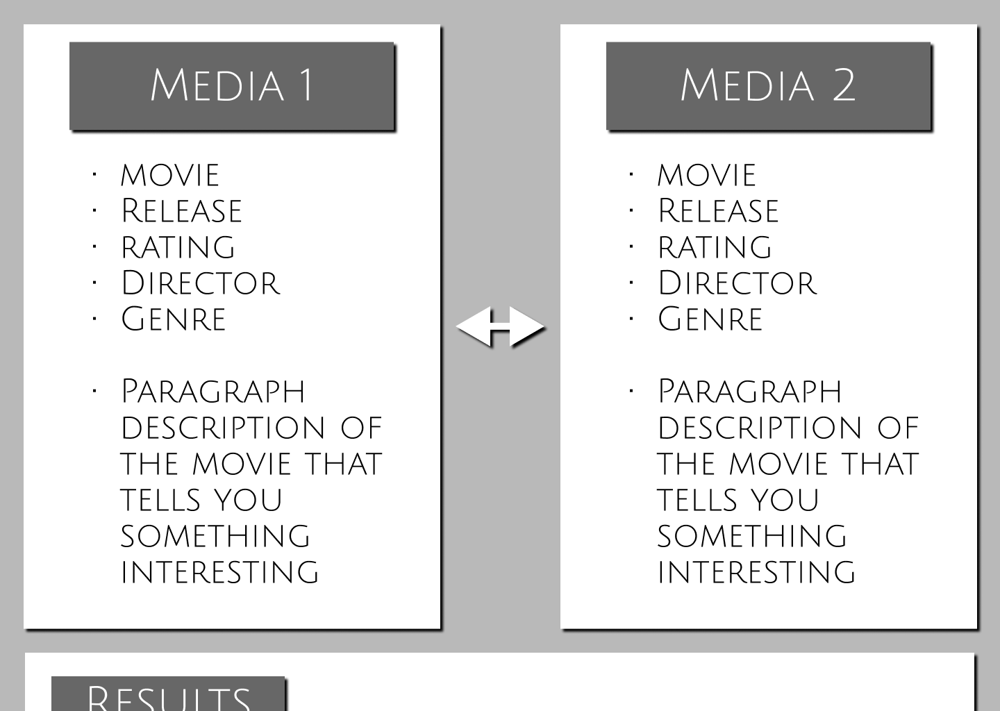
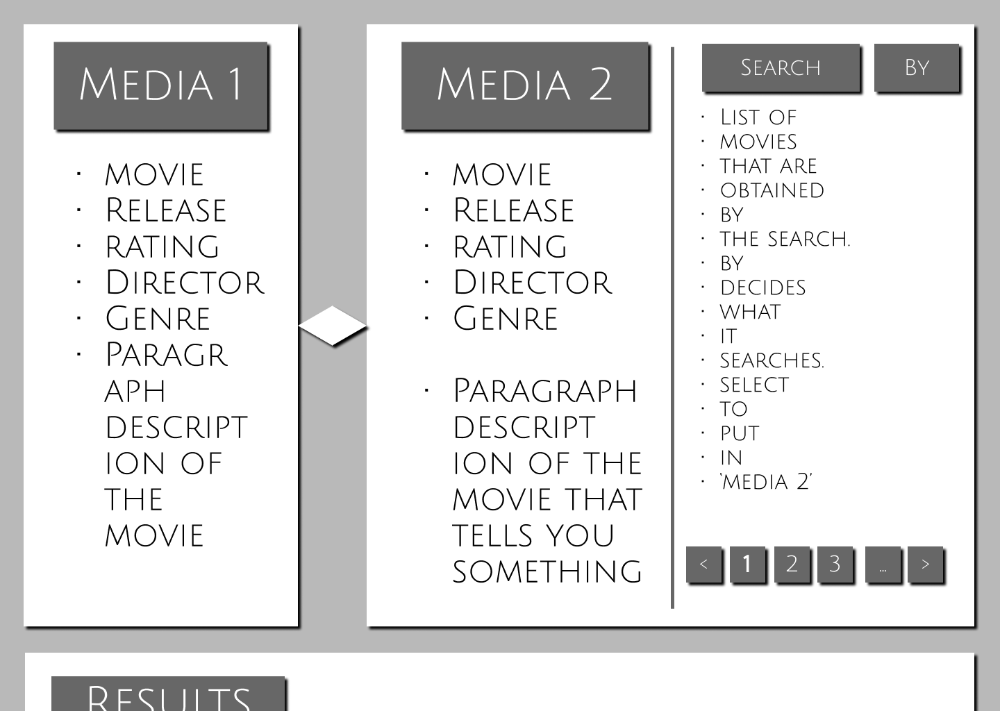
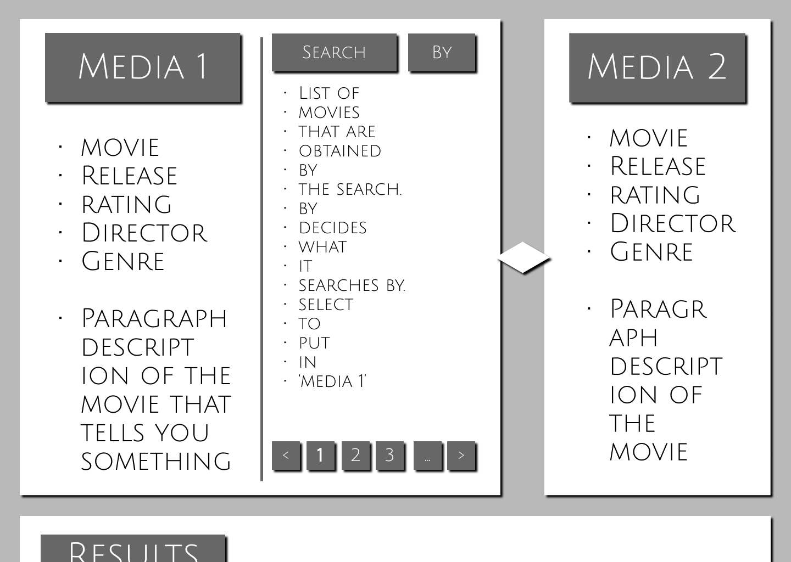
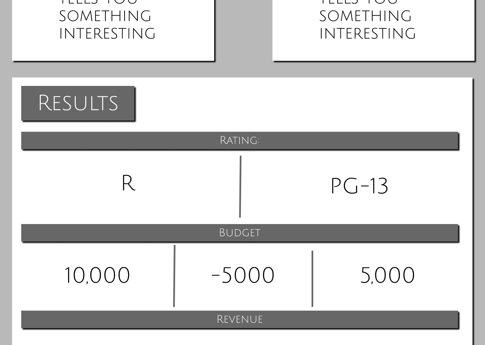

# MediaComparer_FrontEnd
Vercel Front End: https://media-comparer-front-end.vercel.app  
Movies API: https://movie-api-group2-20e70498bde4.herokuapp.com/api-docs  
TVs API: https://g1-tvapi.onrender.com/api-docs/  
Credentials API: https://group3-authsquaredapi.onrender.com/api-docs/  
Figma Mockup: https://www.figma.com/proto/5tBJ4JbfG1p7irkTFgu4up/Media-Comparer?node-id=0-1&t=bnh2Rro0c2CMHmFf-1  

  
  
  
  

## Published Front End version Alpha Contributions

Buruk: Made initial github repository with some tailwind additions    
Cai: Made the Figma prototype for our application, focused on comparing media and based off of hardware comparison websites.    
Victor: Look over materials    
Brittney: Had meetings with Cai and Buruk over some design stuff.
Did spend some time looking over web api credentials because last week seemed to give us some trouble rushing to
get it in and wanted to make sure things would be working okay for the team who uses our work.    
Abdullahi: Tested and confirmed the Credentials API works (register, login, JWT, password, email).    

### Published Front End version Alpha Meetings
Standard meeting with Brittney, Cai, and Buruk on Tuesday, doing the rest of communications afterwards on discord.

### Published Front End version Alpha Comments
was nice to have a little break from coding this week. - Brittney

## Beta 1 Sprint Contributions

Buruk: Added list logic for movies and cleaned up template to better fit our desired web app and made some same 
movies/tv shows with the correct expected input    
Cai: Set up initial template repository, connected to Credentials API. 
Set up the Vercel version of our application. Made final checks + readme additions   
Victor: Made a bug fix to the documentation of our Credentials API.    
Brittney: Created files for movies, tv, mock data, and a few others, and implemented the code inside them. 
Attended meetings and communicated throughout the week.    
Abdullahi: Updated mock data to reflect the actual Movie and TV API formats, and confirmed the catalog and detail 
pages render correctly.   

### Beta 1 Sprint Meetings
Standard meeting with Brittney, Cai, and Buruk on Tuesday, doing the rest of communications afterwards on discord. We 
also had an additional meeting of Brittmey and Cai on Thursday discussing the final TODO's of the sprint. 

### Beta 1 Sprint Comments
Some difficulty due to possible sparce output on the different media API's. 

## Beta Sprint 2 Contribution 
 
#### Buruk 
 connected both 3rd party API and did all of the front page logic with search and filteriong and also made pages for when you click on the media. also i designed and implemnted the add media page.
#### Cai 

Manage group communication, did the comparisons pages as well as the selection mechanism on the catalog page to navigate to said comparison pages 

 
#### Victor 

Fixed a documentation bug for the movie api 
 
#### Brittney 

Did the code for account, change password files and page. Linked to the Api to make it work so a user can change their password by clicking on account. Attended meetings and communicated.  

 
#### Abdullahi 

Fixed one major bug with our movie api 
 
 
### Production Sprint Meetings 
Meeting on Tuesday with Buruk, Cai, and Brittney where we decided on how to split up work and other project deliverables.  
 
### Production Sprint Comments
N/A

## Published Sprint Contribution

#### Buruk

I updated the button styling on all pages to be clean and consistent

#### Cai

Removed unnecessary buttons from the sidebar. Also improved formatting on the compare page and made it so the compare box displays as a box that remains on screen even when scrolling.

#### Victor

N/A

#### Brittney

Added Account settings to other user areas, did testing making sure things function properly, everything seems to be working great. I attended our group meeting and communicated.

#### Abdullahi

Fixed some bugs relating to access to database as well as email verification.

### Production Sprint Meetings
Usual meeting on Tuesday, Buruk, Cai, Brittney. We talked about final clean ups and bug report fixes.

### Production Sprint Comments
This was a great experience for all of us, we learned a lot along the way. We overcame obstacles, strengthening our problem solving and communication skills.  